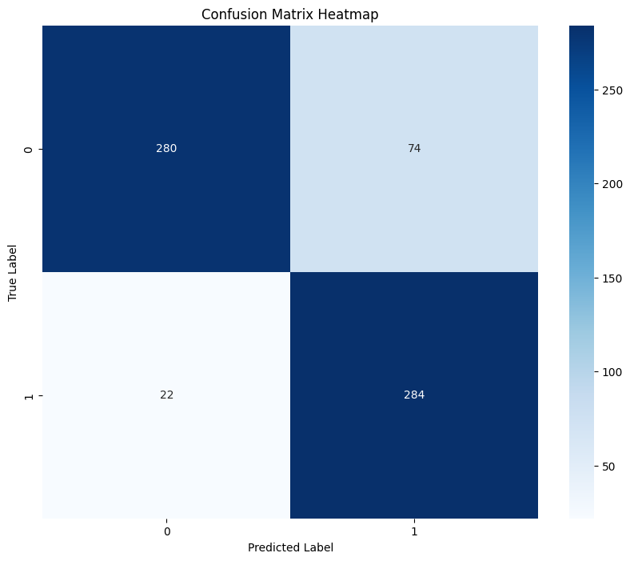
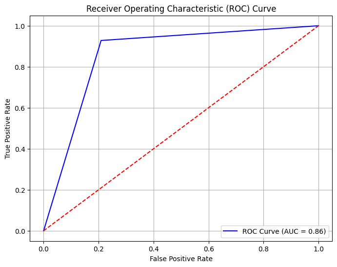
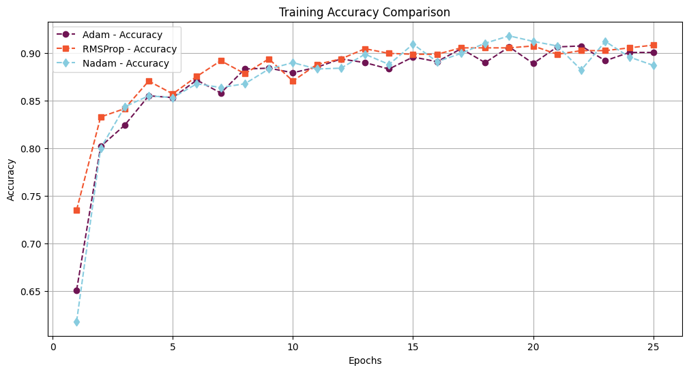
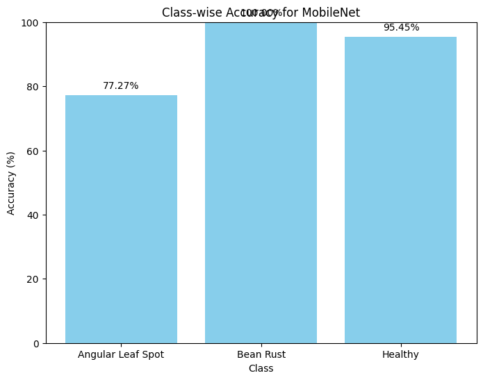
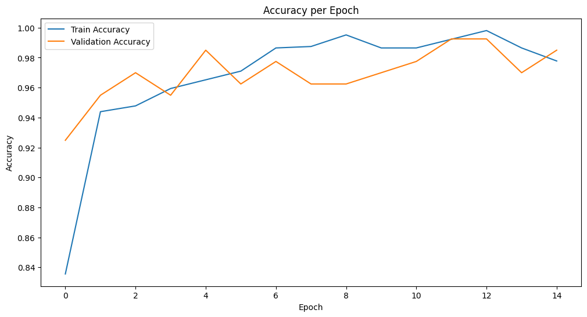
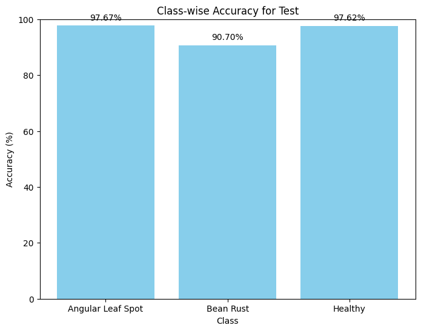
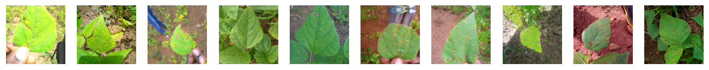

# Skin lesion and bean leaf disease classification

Two image-classification projects in PyTorch, and an audit of how each was
evaluated.

- **[01 — Skin lesion classification](notebooks/01_skin_lesion_classification.ipynb)**
  trains three CNNs from scratch on ISIC dermoscopic images. The models reach
  81–85% accuracy. They are also **not comparable to each other**, for four
  separate reasons, and finding those is the more useful result.
- **[02 — Bean leaf disease](notebooks/02_bean_disease_transfer_learning.ipynb)**
  compares three ImageNet backbones across three optimizers on the iBean
  dataset. The entire 3×3 grid lands between 88% and 95%. Unfreezing the
  **smallest** backbone and fine-tuning it end to end reaches **98.50%
  validation / 95.31% test** — a bigger gain than any choice inside the grid.

A condensed English translation of the original project report is in
**[docs/report.md](docs/report.md)**.

## Results

| Project | Setup | Headline |
|---|---|---|
| Skin lesion | 3 CNNs from scratch, 3,297 images, benign vs malignant | 0.81 → 0.85 accuracy, but **the comparison does not hold** — see below |
| Bean leaf | 3 backbones × 3 optimizers, frozen | 87.97–94.74% val; EfficientNetB6 best at 94.74% |
| Bean leaf | MobileNetV2, **unfrozen** | **98.50% val, 95.31% test** — beats every frozen configuration |
| Bean leaf | Offline augmentation ablation | **No effect.** 93.98% clean vs 94.74% augmented, both peaking at 95.49% |

---

## Project 1 — Skin lesion classification

3,297 ISIC dermoscopic images (1,800 benign, 1,497 malignant), 224×224,
resized to 128×128, split 80/20. Three architectures trained from scratch with
Adam, cross-entropy, `ReduceLROnPlateau` and early stopping.

| Model | Accuracy | Benign P/R | Malignant P/R | Macro F1 |
|---|---|---|---|---|
| `ArticleCNN` — 4 conv blocks, 3 FC layers | 0.81 | 0.91 / 0.71 | 0.74 / 0.92 | 0.81 |
| `ModifiedArticleCNN` — + BatchNorm, global avg pool | **0.85** | 0.93 / 0.79 | 0.79 / 0.93 | 0.85 |
| `DeeperCNN` — 6 conv layers | 0.85 | 0.91 / 0.80 | 0.79 / 0.90 | 0.85 |

All three over-predict malignant — recall 0.90–0.93 against benign recall
0.71–0.80. For a screening task that is arguably the right failure mode: the
cost of a missed melanoma is not the cost of an unnecessary biopsy.



280 of 354 benign and 284 of 306 malignant correct. The 74 benign lesions
flagged as malignant are most of the total error.

### Four defects in the evaluation

The numbers above are what the original run recorded. They should not be read
as a clean architecture comparison, because the three models differ in more
than architecture:

**1. The split was never seeded.** `random_split` was called with no
generator, so each model was evaluated on a different validation set. The
class supports give it away — 348/312, 354/306 and 363/297 across the three
runs, all summing to 660.

**2. Validation images were augmented.** The notebook built a `transform_val`
without augmentation, then immediately discarded it:

```python
val_dataset = datasets.ImageFolder(root=dataset_dir, transform=transform_val)
train_dataset, val_dataset = torch.utils.data.random_split(train_dataset, [...])
```

The third line overwrites the second. Both subsets come from the ImageFolder
carrying `transform_train`, so every reported accuracy was measured on
randomly flipped, rotated, colour-jittered and crop-resized images.
`transform_val` was dead code. (There is no train/validation leakage —
`random_split` indices are disjoint — the validation images were just
distorted.)

**3. Softmax was applied twice, for two of the three models.** `ArticleCNN`
and `ModifiedArticleCNN` both end `forward` with
`x = F.softmax(self.output(x), dim=1)`, and training uses
`nn.CrossEntropyLoss()`, which applies `log_softmax` internally.
`DeeperCNN` returns raw logits and is therefore the only one of the three
trained against a correctly-scaled loss. Any conclusion about whether the
extra depth helped is measuring that difference at least as much as it is
measuring depth.

**4. The ROC curve has three points.**



`roc_curve(y_true, y_pred)` was passed `argmax` hard labels rather than
probabilities, so there is no threshold to sweep. The resulting "AUC = 0.86"
is arithmetically just balanced accuracy:
`(284/306 + 280/354) / 2 = (0.9281 + 0.7910) / 2 = 0.8596`.

All four are fixed in the notebook, each marked with a `FIX` comment at the
site. **The notebook has not been re-run since** — that needs a GPU and the
dataset, and the numbers above should be expected to move once it is.

---

## Project 2 — Bean leaf disease classification

The iBean dataset: 1,034 training / 133 validation / 128 test images across
three classes (angular leaf spot, bean rust, healthy), 500×500 resized to
224×224. The dataset's own splits are used as given, so the test set stays
untouched until the end.

### The frozen grid

Three backbones — MobileNetV2, EfficientNetB6, NasNet — each with Adam,
RMSProp and Nadam, 25 epochs, backbone weights frozen, classifier head only.



| Backbone | Adam | RMSProp | Nadam |
|---|---|---|---|
| EfficientNetB6 | 93.98 | **94.74** | **94.74** |
| MobileNetV2 | 93.98 | 87.97 | 90.23 |
| NasNet | 89.47 | 88.72 | 87.97 |

NasNet is the clearest overfit: 94–95% training accuracy against 88–89%
validation in every column. EfficientNetB6 is the most stable and the best.
The optimizer moves things by up to 6 points for MobileNetV2 and by under 1
point for EfficientNetB6 — it matters, but only where the backbone is weak.

*(The summary table in the original notebook was transcribed by hand and four
of its nine rows do not match the training logs, the worst being
RMSProp/NasNet — recorded 90.52/87.97, logged 94.58/88.72. The table above and
the one in the notebook are regenerated from the logs.)*

### Angular leaf spot is the hard class



In every frozen run, one class carries the error. MobileNetV2 gets angular
leaf spot right 77.27% of the time while managing the other two comfortably;
NasNet manages 81.82%; EfficientNetB6 with dropout, 90.91%. Angular leaf spot
and bean rust both present as brown lesions on green leaf — the distinction is
in lesion *shape*, and a frozen ImageNet backbone has no reason to have
learned features that separate them.

### Unfreezing the backbone



Every run above trains a classifier head on top of frozen ImageNet features.
Handing `optim.Adam` the full `model.parameters()` instead changes the result
more than any other decision in the notebook:

| | Validation | Test |
|---|---|---|
| Best frozen (EfficientNetB6, RMSProp) | 94.74% | — |
| **MobileNetV2, unfrozen** | **98.50%** | **95.31%** (122/128) |

Per-class, the hard class stops being hard: angular leaf spot goes from 77.27%
frozen to **100%** on validation and 97.67% on test.



The smallest of the three backbones, fully fine-tuned, beats every frozen
configuration of the two larger ones. Lesion shape is not something ImageNet
features encode, so no amount of head-tuning recovers it; letting the
convolutions move does.

### The augmentation did nothing



Albumentations pipeline — horizontal flip, ±45° rotation, shift/scale/rotate,
brightness and contrast jitter, Gaussian blur, elastic and grid distortion.
Three 10-epoch runs on frozen EfficientNetB6:

| Training set | Final val | Best val |
|---|---|---|
| Clean, 1,034 images | 93.98% | 95.49% (epoch 9) |
| Clean + augmented, 2,068 | *interrupted at epoch 5* | 93.23% |
| Augmented only, 1,034 | 94.74% | 95.49% (epoch 9) |

Clean and augmented-only peak identically and end 0.76 points apart — one
image is 0.75 points on a 133-image validation set, so that is noise.

The reason is that the augmentation is applied **once, offline**. It builds a
fixed array of perturbed copies before training starts, so each image gets one
frozen perturbation seen 10 times, rather than a fresh one every epoch. Moved
into the training transform it would be doing real work; as written it is
closer to a slightly different dataset than to augmentation.

---

## Setup

```bash
pip install -r requirements.txt
jupyter lab
```

Both notebooks resolve data through a `DATA` path set in their first cell, so
they run from either the repository root or `notebooks/`. Neither dataset is
committed — both download from Kaggle on first run and need an API token at
`~/.kaggle/kaggle.json`:

| Dataset | Kaggle slug | Size |
|---|---|---|
| ISIC skin lesions | `rm1000/skin-cancer-isic-images` | ~50 MB |
| iBean leaf disease | `prakharrastogi534/bean-leaf-dataset` | ~172 MB |

Both notebooks need a CUDA GPU to train in reasonable time. Notebook 2
additionally installs `timm` and `efficientnet-pytorch` from cells.

## Notes on reproducibility

Neither notebook has been re-run since the fixes described above. The figures
in `assets/` and every number on this page come from the original recorded
runs; outputs are stripped from the committed notebooks.

For notebook 1 specifically, the four defects mean the recorded numbers are
not what a corrected run would produce. The split is now seeded
(`SEED = 42`), validation no longer sees augmented images, both models return
logits, and the ROC curve is fed probabilities — all four change the result.
Expect the three models to become comparable and the AUC figures to stop
agreeing with balanced accuracy.

For notebook 2, three cells in the original were dead or broken and are
dropped: the three `resize_for_*` helpers, none of which is ever called, one
of which contains a stray quote that makes it a `SyntaxError`. A zero-width
non-joiner left over from Persian typing made a fourth cell unparseable and
has been removed.

## License

[MIT](LICENSE)
