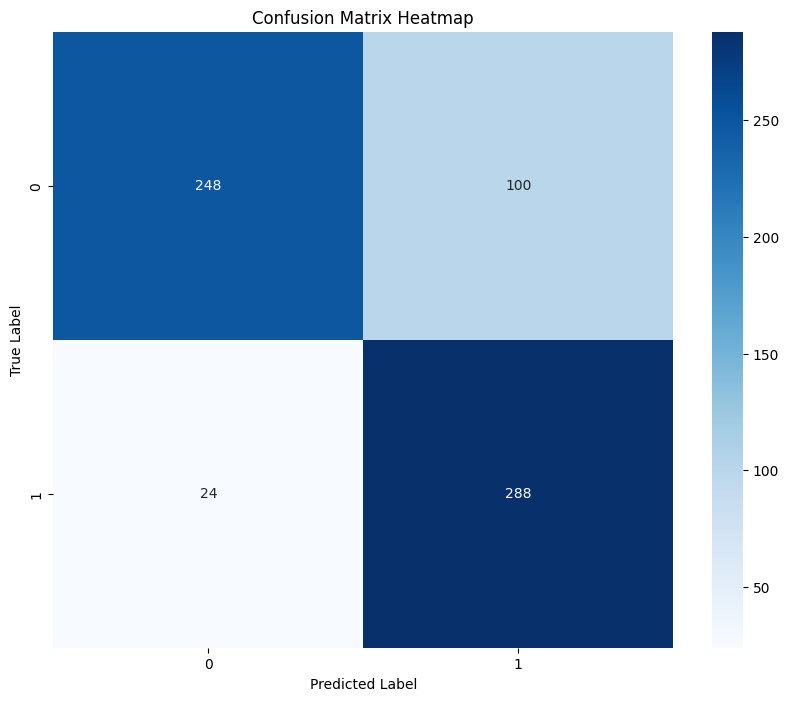
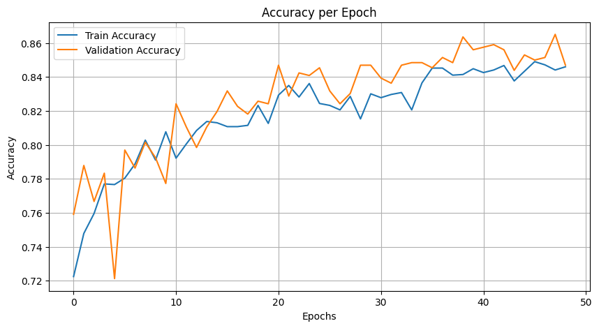
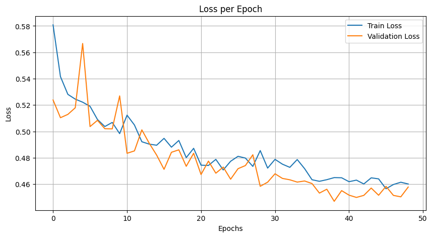
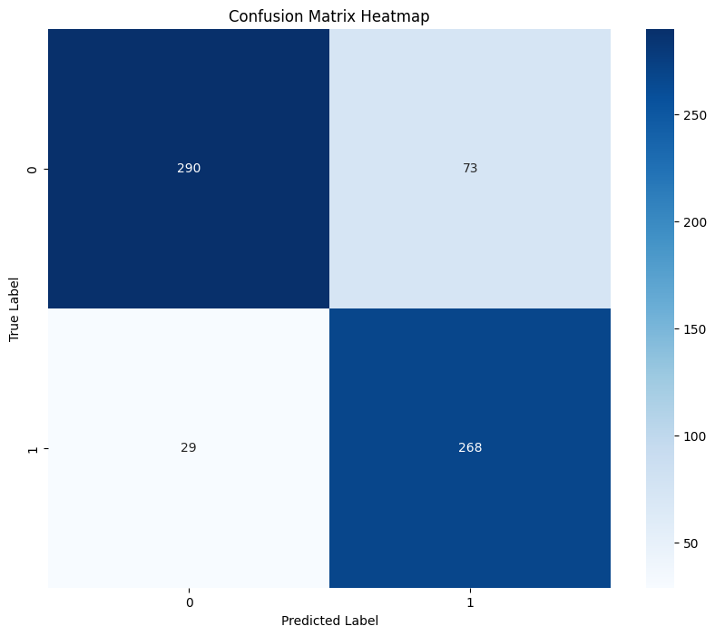
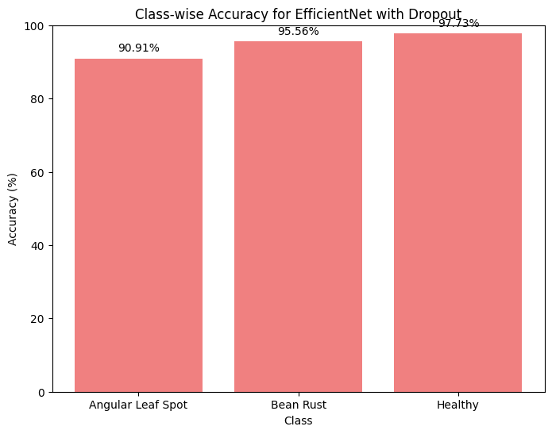
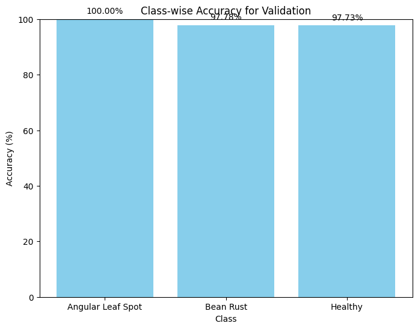

# Project report

A condensed English translation of the original 72-page Persian report
(`report.pdf`, kept locally but not committed). It is a summary rather than a
literal translation: the method, the design decisions and the analysis are
here; the textbook explanations of standard concepts are not.

Where the report and the committed notebooks disagree, both numbers are given
and the disagreement is flagged.

---

# Part 1 — Skin lesion classification

## Dataset

ISIC dermoscopic images, two classes:

| Class | Images |
|---|---|
| benign | 1,800 |
| malignant | 1,497 |
| **total** | **3,297** |

Exploratory analysis found every image already at 224×224, so no aspect-ratio
handling was needed — only a downscale to the 128×128 the networks take.

## Preprocessing

**Resizing to 128×128.** Convolution and pooling stacks need a fixed input
size, and a uniform size is what lets a batch be one tensor. 128 rather than
224 to keep training tractable.

**Normalisation to [-1, 1]** (`mean=0.5, std=0.5`). Raw pixel values in
[0, 255] produce large, badly-scaled gradients; normalising keeps them in a
narrow band and speeds convergence.

**Augmentation**, training split only: rotation (±20°), zoom/scale (0.8–1.2),
horizontal flip, brightness and contrast jitter, and random resized crop. The
stated purpose is to reduce overfitting on a dataset this size by presenting
each lesion under transformations that do not change its class — a rotated
melanoma is still a melanoma.

> **Correction.** The augmentation was applied to *both* splits, not the
> training split only. See defect 2 in the [README](../README.md#four-defects-in-the-evaluation).

## Architectures

### `ArticleCNN` — the reference architecture

Four convolution blocks with max-pooling after each (16 → 32 → 64 → 128
channels, 3×3 kernels), flattened into three fully-connected layers
(512 → 64 → 32 → 2) with dropout 0.5.

### `ModifiedArticleCNN` — two changes

**Batch normalisation** after every convolution. It normalises each layer's
activations per batch, which limits internal covariate shift — the moving
target every layer faces as the layers below it update — and lets the network
converge in fewer epochs. It also has a mild regularising effect, since the
batch statistics differ from batch to batch.

**Global average pooling** replacing the flatten. Where flatten hands
128×8×8 = 8,192 values to a `Linear(8192, 512)`, global average pooling
collapses each feature map to its mean, giving 128 values. That removes the
largest weight matrix in the network and most of its parameters with it, which
is a strong regulariser in its own right. Average rather than max pooling
because a lesion's signal is spread across the region rather than concentrated
in one activation.

### `DeeperCNN` — the extension

Six convolutions in three double-convolution blocks. No batch normalisation,
no global pooling — the question being whether depth alone buys anything.

## Training

Adam at lr 0.001, cross-entropy loss, `ReduceLROnPlateau` on validation loss
(patience 5), early stopping (patience 10) against a 50-epoch budget, batch
size 32, 80/20 train/validation split. The best checkpoint by validation loss
is kept.

## Results

### `ArticleCNN`

| | Precision | Recall | F1 |
|---|---|---|---|
| Benign | 0.91 | 0.71 | 0.80 |
| Malignant | 0.74 | 0.92 | 0.82 |
| **Accuracy** | | | **0.81** |

AUC 0.82. Early stopping fired at epoch 23 of 50.

The report's reading: the model is strongly biased toward predicting
malignant — recall 0.92 against benign recall 0.71. It rarely misses a
melanoma and frequently over-calls a benign mole. For a screening tool that
asymmetry is defensible, since the two error types do not cost the same.

### `ModifiedArticleCNN`

The report and the notebook record **different runs** of this model on the
same split (both have supports 354 benign / 306 malignant):

| | Report | Committed notebook |
|---|---|---|
| Benign correct | 300 / 354 | 280 / 354 |
| Malignant correct | 269 / 306 | 284 / 306 |
| Benign P / R | 0.89 / 0.85 | 0.93 / 0.79 |
| Malignant P / R | 0.83 / 0.88 | 0.79 / 0.93 |
| Accuracy | 0.86 | 0.85 |
| AUC | 0.86 | 0.86 |

Both are internally consistent, so this is two training runs rather than a
transcription error. The report's run is the more balanced of the two; the
notebook's repeats the malignant skew of the baseline. Accuracy differs by one
point, the per-class behaviour by six to fourteen.

The README quotes the notebook's numbers throughout, on the grounds that they
are the ones a reader can verify from committed output.

The report's conclusion from this comparison — that batch normalisation,
global average pooling and dropout together lift accuracy from 0.81 to 0.86
and balance precision against recall — holds under either run, though the
margin is 0.04 rather than 0.05 using the notebook's figures.

The training curves for the notebook's run:

Training and validation track each other closely throughout — the
regularisation is doing its job, and there is no visible overfit to early-stop
against.

### `DeeperCNN`

| | Precision | Recall | F1 | Support |
|---|---|---|---|---|
| Benign | 0.91 | 0.80 | 0.85 | 363 |
| Malignant | 0.79 | 0.90 | 0.84 | 297 |
| **Accuracy** | | | **0.85** | 660 |

Report and notebook agree exactly here.

The report's conclusion is that depth alone does not beat regularisation:
`DeeperCNN` has more convolutional layers than `ModifiedArticleCNN` and does
not exceed it. It attributes this to the absence of batch normalisation and
global pooling, and notes the same malignant skew persists.

> **Caveat.** `DeeperCNN` is the only one of the three that returns raw
> logits. The other two apply `F.softmax` inside `forward` while training with
> `nn.CrossEntropyLoss`, which applies `log_softmax` again. The depth
> comparison is therefore confounded with a loss-scaling difference, and this
> conclusion does not follow from the evidence as recorded. See defect 3 in the
> [README](../README.md#four-defects-in-the-evaluation).

## Metrics

The report devotes several pages to why accuracy alone is inadequate here and
settles on precision, recall, F1 and AUC. Its argument: with 1,800 benign
against 1,497 malignant the classes are close enough to balanced that accuracy
is not actively misleading, but it still hides which class the errors fall on
— and in a screening context that is the whole question.

> **Caveat.** The AUC figures throughout are computed from `argmax` labels
> rather than probabilities, so they are balanced accuracy under another name.
> See defect 4 in the [README](../README.md#four-defects-in-the-evaluation).

---

# Part 2 — Bean leaf disease classification

## Dataset

The iBean dataset, three classes — healthy, angular leaf spot, bean rust —
shipped with its own split:

| Split | Images |
|---|---|
| train | 1,034 |
| validation | 133 |
| test | 128 |

Roughly 80/10/10. The report keeps the given split rather than re-partitioning,
so the test set is untouched until the final evaluation. Source images are
500×500 RGB.

## The three backbones

**MobileNetV2** (torchvision). Built for mobile inference: depthwise
separable convolutions factor a standard convolution into a per-channel
spatial filter and a 1×1 pointwise mix, which cuts the parameter count sharply,
and inverted residual bottlenecks carry the skip connections between the narrow
ends of each block. Native input 224×224. The smallest of the three.

**EfficientNetB6** (`efficientnet-pytorch`). Compound scaling — depth, width
and input resolution scaled together by a fixed ratio rather than one at a
time. Built from MBConv blocks with Swish activations. Native input 528×528.
The largest of the three.

**NasNet** (`timm`). Architecture found by neural architecture search rather
than designed: a search procedure over Normal Cells (preserving spatial
dimensions) and Reduction Cells (halving them), stacked into a network. Native
input 331×331.

All three are used as ImageNet-pretrained feature extractors with a replaced
fully-connected head.

> **Note.** The report describes resizing each image to its backbone's native
> resolution, and the notebook defines a `resize_for_*` helper for each. None
> of the three helpers is ever called: every training cell resizes to 528×528
> and then the dataset transform resizes again to 224×224. All three backbones
> were in fact fed 224×224.

## Augmentation

The report lists the transformations it considers appropriate for leaf
photographs — rotation, translation, shearing, horizontal flip, brightness,
contrast, hue/saturation, Gaussian noise, blur, cutout — and implements a
subset with Albumentations: horizontal flip (p=0.5), rotation ±45° (p=0.5),
shift/scale/rotate (p=0.5), brightness and contrast jitter (p=0.3), Gaussian
blur (p=0.2), elastic transform (p=0.2), grid distortion (p=0.2).

The rationale given is that a leaf photographed from a different angle, at a
different time of day, or slightly out of focus is the same leaf with the same
disease — so these transformations expand the effective dataset without
corrupting the labels.

> **Finding.** They do not, as implemented. The pipeline runs **once, before
> training**, producing a fixed array of perturbed copies. Each image is seen
> with one frozen perturbation across all epochs rather than a fresh one each
> epoch, which is much weaker than augmenting inside the training loop. The
> ablation confirms it: clean 93.98% against augmented-only 94.74%, both
> peaking at 95.49%. On a 133-image validation set one image is 0.75 points,
> so that difference is noise.

## Optimizers

**Adam.** Per-parameter adaptive learning rates from running estimates of the
first and second moments of the gradient. The default choice, and robust
without tuning.

**RMSProp.** Divides the learning rate by a running root-mean-square of recent
gradients, which damps oscillation in steep directions. Adam is roughly
RMSProp with momentum added.

**Nadam.** Adam with Nesterov momentum — the gradient is evaluated at the
anticipated next position rather than the current one, which is a
look-ahead correction on the update direction.

## Configuration

25 epochs, batch size 32, lr 0.001, cross-entropy loss, dropout 0.3 on the
classifier head, ImageNet normalisation. Backbone weights frozen; only the
head trains.

## Results — the frozen grid

Final-epoch validation accuracy:

| Backbone | Adam | RMSProp | Nadam |
|---|---|---|---|
| EfficientNetB6 | 93.98 | **94.74** | **94.74** |
| MobileNetV2 | 93.98 | 87.97 | 90.23 |
| NasNet | 89.47 | 88.72 | 87.97 |

The report's reading, which the logs support: EfficientNetB6 is the most
stable and the best; NasNet overfits visibly, holding 94–95% training accuracy
against 88–89% validation in every column; the optimizer choice matters by up
to six points where the backbone is weak and by under one point where it is
strong.

> **Correction.** The summary table in the original notebook was typed by hand
> and four of its nine rows disagree with the training logs above them — the
> worst being RMSProp/NasNet, recorded as 90.52/87.97 against a logged
> 94.58/88.72. The table above and the one now in the notebook are regenerated
> from the logs.

### Per-class accuracy

Angular leaf spot is the hard class in every frozen configuration:

| Backbone (frozen) | Angular leaf spot |
|---|---|
| MobileNetV2 | 77.27% |
| NasNet | 81.82% |
| EfficientNetB6 + dropout | 90.91% |

Angular leaf spot and bean rust both present as brown lesions on green leaf.
What separates them is lesion *shape* — angular and vein-bounded against
roughly circular — and a frozen ImageNet backbone has no particular reason to
carry features that encode it.

## The final result: fine-tuning the whole network

Every configuration above freezes the backbone. The last experiment does not:
`optim.Adam` is handed `model.parameters()` in full, so all of MobileNetV2
trains.

| | Validation | Test |
|---|---|---|
| Best frozen (EfficientNetB6, RMSProp) | 94.74% | — |
| **MobileNetV2, unfrozen** | **98.50%** | **95.31%** |

Per-class, on the previously hardest class:

| | Angular leaf spot | Bean rust | Healthy |
|---|---|---|---|
| Validation | 100% | 97.78% | 97.73% |
| Test | 97.67% | 90.70% | 97.62% |

The report presents this as the project's main finding and notes it exceeds
the values the reference paper reports.

The structural point it makes is the one worth keeping: the smallest of the
three backbones, fully fine-tuned, beats every frozen configuration of the two
larger ones. Choosing *what to train* mattered more than choosing the backbone
or the optimizer. Lesion shape is not something ImageNet features already
encode, so no amount of head-tuning recovers it — letting the convolutions
move does.
